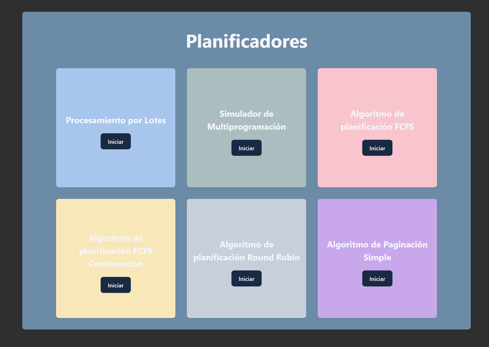

# Actividades de Seminario de Sistemas Operativos 🍀

**✅En este proyecto se simulan distintos tipos de administracion y planificación de procesos relacionados con los sistemas operativos. Para el desarrollo de este proyecto se uso el lenguage de JavaScript haciendo uso de la tecnologia de ⚛️ React + Vite.**

## Home page



## 🍃 Procesamiento por lotes
Procesamiento por lotes (Batch Processing): Este es un enfoque en el que los programas se agrupan en lotes y se ejecutan en secuencia sin interacción en tiempo real con el usuario. Es común en sistemas informáticos antiguos y se utiliza para procesar grandes cantidades de datos de manera eficiente, donde se carga un lote de trabajos, se ejecutan en orden y luego se carga otro lote.

[Implementacion de procesamiento por lotes](./src/batches1/)

## 🌿Multiprogramación
Multiprogramación (Multiprogramming): La multiprogramación es una técnica que permite que múltiples programas se ejecuten en una computadora al mismo tiempo. El sistema operativo asigna tiempo de CPU a cada programa de manera intercalada para lograr una apariencia de ejecución simultánea, lo que mejora la utilización de los recursos de la computadora.

[Implementacion de multiprogramación](./src/multiprogramming/)

## 🌳 FCFS
 "First-Come, First-Served", es uno de los algoritmos de planificación de procesos más simples y fundamentales en sistemas operativos y sistemas de administración de tareas. Su funcionamiento es bastante intuitivo: los procesos se ejecutan en el orden en el que llegan a la cola de planificación, y el primero en llegar es el primero en ser atendido. En otras palabras, se da prioridad a los procesos en función de su tiempo de llegada.

[Implementacion de FCFS](./src/FCFS/)

## 🌹 FCFS - Continuacion
Solamente se agregan mejoras y la Tabla de
procesos.

[Implementacion de FCFS - continuación](./src/improved-fcfs/)

## 🎍 Round-Robin

El algoritmo de planificación Round-Robin asigna un pequeño intervalo de tiempo de CPU, llamado "quantum", a cada proceso en un ciclo circular. Los procesos se ejecutan en turnos y, si un proceso no ha completado su ejecución durante su quantum, se mueve al final de la cola y se le da otra oportunidad más adelante. Este enfoque equitativo es eficiente para compartir recursos de manera justa, pero puede generar un alto tiempo de respuesta.

[Implementacion de Round-Robin](./src/round-robin/)

## 🌼 Paginación Simple

En la paginación simple, la memoria física y lógica se divide en bloques fijos llamados "páginas". Los programas se dividen en páginas del mismo tamaño, y estas páginas se cargan en marcos de página en memoria física. El sistema operativo mantiene una tabla de páginas para realizar la traducción de direcciones lógicas a físicas. La paginación simple permite la carga y descarga flexible de páginas, facilitando la gestión de la memoria, pero puede llevar a fragmentación interna.

[Implementacion de Paginación Simple](./src/simple-pagination/)


## 📂 Estructura del Proyecto 

- `src/`: Contiene los archivos fuente del proyecto.
  - `components/`: Componentes de React utilizados en la interfaz de usuario.
  - `batches1/`
  - `multiprogramming/`
  - `FCFS/`
  - `improved-fcfs/`
  - `round-robin/`
  - `simple-pagination/`
  - `pages/`: Contiene las paginas de la aplicación.
  - `styles/`: Contiene los estilos de los componentes.
  - `index.css`: Estilos globales de la aplicación.
  - `main.js`: Punto de entrada para el archivo de configuración de Vite y la implementacion de React router.
- `public/`: Contiene archivos estáticos accesibles públicamente.
- `package.json`: Archivo de configuración de dependencias y scripts.

## 📗 Instalación

1. Clona este repositorio a tu máquina local utilizando el siguiente comando:

   ```bash
   git clone https://github.com/ed-corne/SimuladorProcesamientoLotes.git
   ```

2. Navega al directorio del proyecto:

   ```bash
   cd vite-project
   ```

3. Instala las dependencias utilizando npm o yarn:

   ```bash
   npm install
   # o
   yarn install
   ```

4. Inicia el servidor de desarrollo con el siguiente comando:

   ```bash
   npm run dev
   # o
   yarn dev
   ```

---
Edwin Cornejo 👨🏻‍💻💚.

