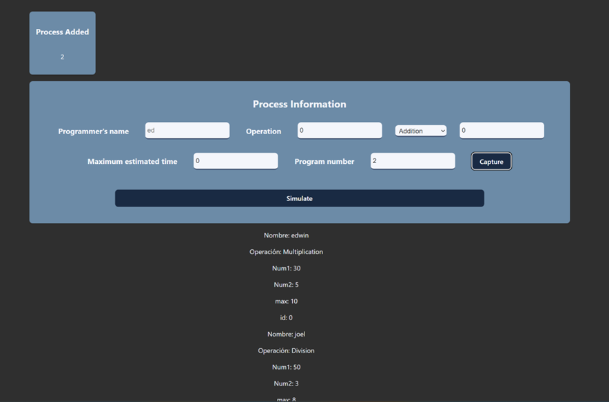
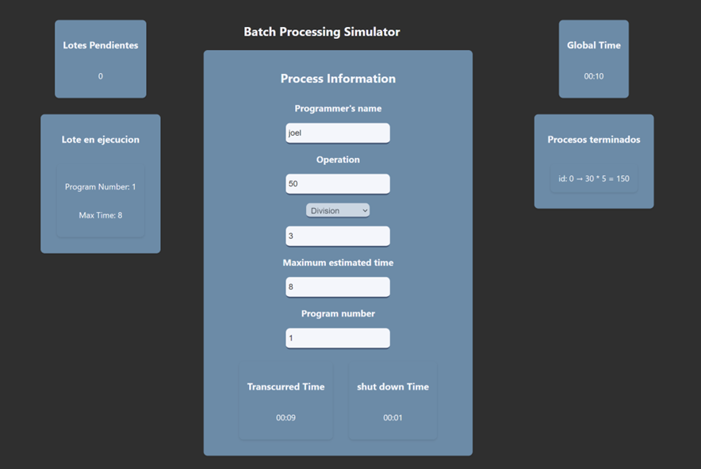

# Funcionamiento del Procesamiento por lotes 🍃

🌲 Formulario para generar un proceso.

🌵 Se van listando los procesos y aumenta el numero de estos.

🍀 Ahora se muestra la simulacion del procesamiento por lotes.

-------------------------------------

Edwin Cornejo 👨🏻‍💻💚.
