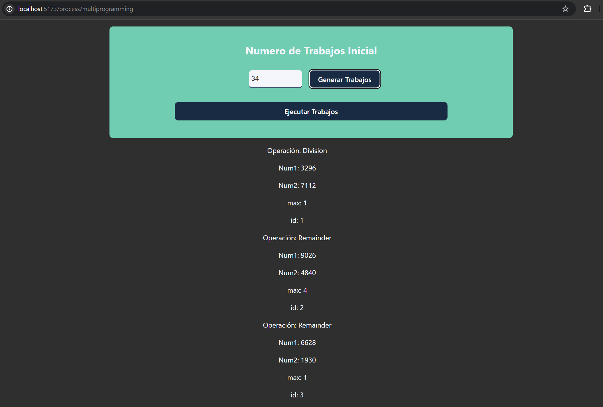
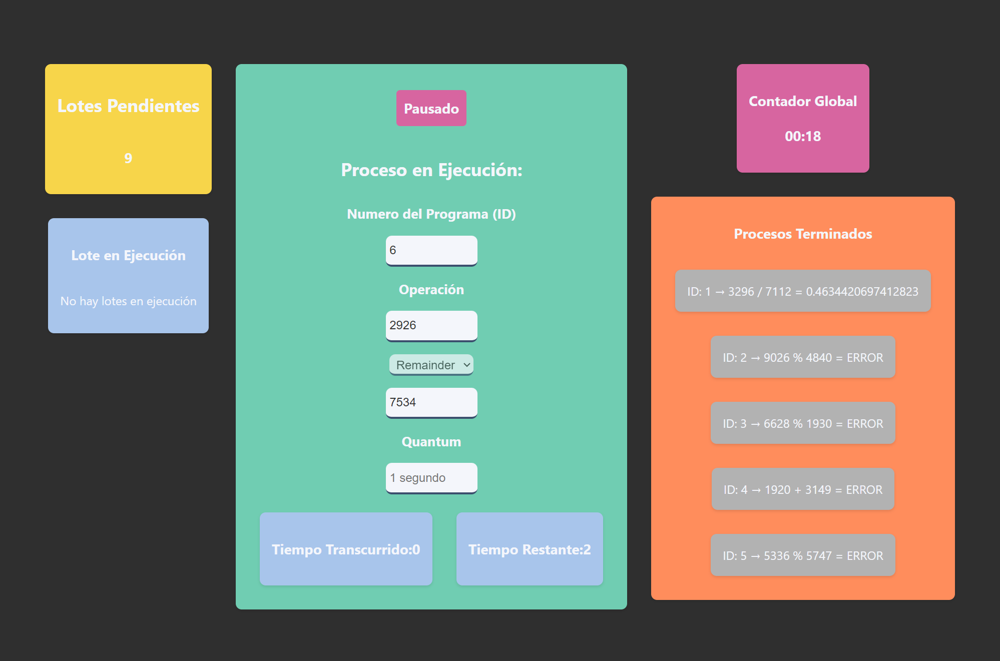

# Funcionamiento del planificador por Multiprogramación 🌼

🍐 Se agrego la interrupción y la terminación de los trabajos en ejecución por medio de teclas.
Las teclas a utilizar son:

- **I** > El proceso se va a la cola de los procesos del lote en ejecución.
- **E** > Termina el proceso con error.
- **P** > Se pausa el programa.
- **C** > Continua la ejecución.

🍃 Ingresamos el numero de procesos y se generan automaticamnete.

🌻 Comienza la simulacion por multiprogramacion.

🍀 Se muestra pausado y con algunos procesos terminados con error.

-------------------------------------

Edwin Cornejo 👨🏻‍💻💚.