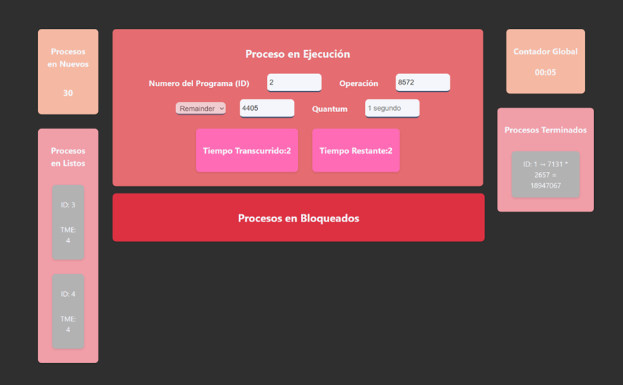
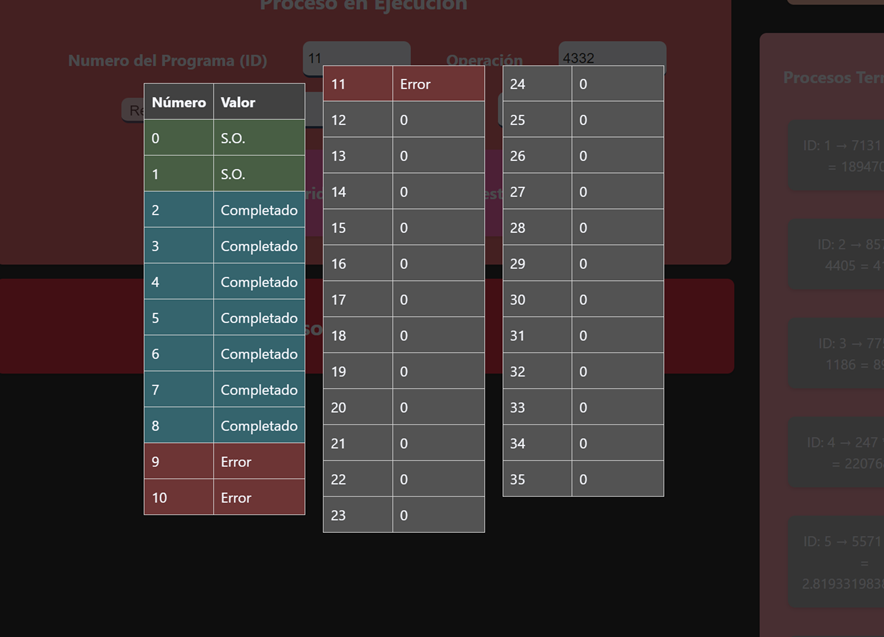

# Funcionamiento del Algoritmo de Paginación Simple 🎋

🪴 Se usan las teclas para las interrupciónes,
las teclas a utilizar son:

- **I** -> El proceso se va a la cola de los procesos bloqueados.
- **E** -> Se termina el proceso, y se marca con error
- **P** > Se pausa el programa.
- **C** > Continua la ejecución.
- **N** > se generará un nuevo proceso
- **T** -> el programa se pausará y se deberá visualizar la tabla de procesos.
- **M** -> el programa se pausará y se deberá visualizar la tabla de paginas.

🌿  Comienza la simulacion y se muestra, con algunos procesos terminados con error y la cola de procesos bloqueados, y el quantum que es de 1 segundo.

🌹 Con la tecla M se visualiza la tabla de paginas.

-------------------------------------

Edwin Cornejo 👨🏻‍💻💚.